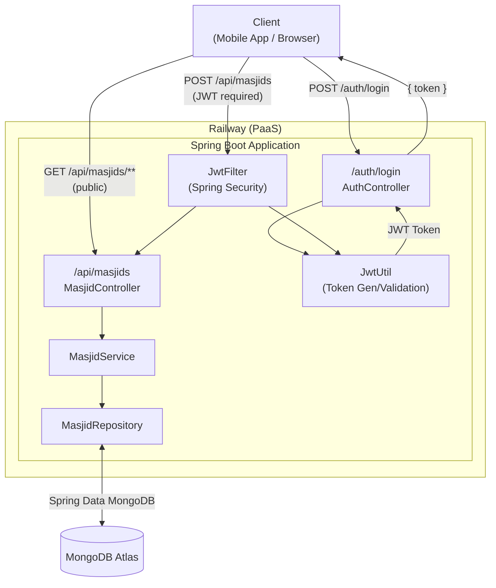

# PrayNow Backend

Spring Boot REST API for serving masjid iqama (prayer) times. Mosque admins can log in and upload monthly prayer schedules; anyone can read them publicly.

Live API: `https://praynow-backend-production.up.railway.app`

---

## Architecture



---

## Data Model

Each document in the `masjids` collection represents one masjid's schedule for a single month.

```
Masjid
├── id            (MongoDB ObjectId)
├── masjidId      (e.g. "icor")
├── masjidName    (e.g. "Islamic Center of Redmond")
├── city / state
├── year / month
├── location
│   ├── lat / lng
│   └── address
└── days[]
    ├── date      (e.g. "2026-03-22")
    ├── day       (e.g. "Sunday")
    ├── fajr
    ├── dhuhr
    ├── asr
    ├── maghrib
    └── isha
```

---

## Tech Stack

| Layer | Technology |
|---|---|
| Language | Java 21 |
| Framework | Spring Boot 3.5 |
| Database | MongoDB Atlas |
| Auth | JWT (JJWT 0.12) |
| Security | Spring Security (stateless) |
| API Docs | Swagger UI (SpringDoc OpenAPI) |
| Deployment | Railway |

---

## API Reference

Swagger UI: `https://praynow-backend-production.up.railway.app/swagger-ui.html`

### Auth

| Method | Endpoint | Auth Required | Description |
|--------|----------|:---:|-------------|
| POST | `/auth/login` | No | Returns a JWT token |

**Request body:**
```json
{ "username": "...", "password": "..." }
```
**Response:**
```json
{ "token": "<jwt>" }
```

### Masjids

| Method | Endpoint | Auth Required | Description |
|--------|----------|:---:|-------------|
| GET | `/api/masjids` | No | Get all masjid schedules |
| GET | `/api/masjids/{masjidId}` | No | Get all schedules for a masjid |
| GET | `/api/masjids/{masjidId}/{year}/{month}` | No | Get schedule for a specific month |
| POST | `/api/masjids` | **JWT** | Upload a masjid schedule |

For protected endpoints, pass the token as a Bearer header:
```
Authorization: Bearer <token>
```

---

## Local Setup

### Prerequisites
- Java 21
- Maven
- MongoDB (local instance or Atlas connection string)

### Steps

1. Create `src/main/resources/application-local.properties`:
```properties
spring.data.mongodb.uri=mongodb://localhost:27017/praynow
app.token.secret=your-secret-key
app.token.expiration=86400000
app.auth.username=admin
app.auth.password=your-password
app.auth.username2=admin2
app.auth.password2=your-password2
```

2. Run:
```bash
mvn spring-boot:run -Dspring-boot.run.profiles=local
```

3. Visit `http://localhost:8080/swagger-ui.html`

---

## Deployment

Deployed on [Railway](https://railway.app). Railway auto-detects the Maven project via Nixpacks, builds the JAR, and runs:

```
java -jar target/praynow-0.0.1-SNAPSHOT.jar
```

Environment variables (MongoDB URI, JWT secret, admin credentials) are configured in the Railway dashboard.
